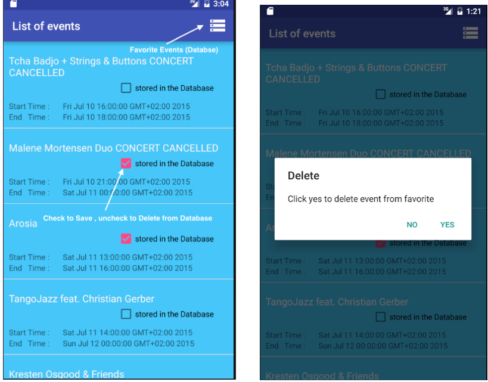
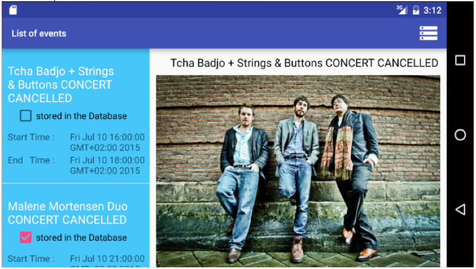
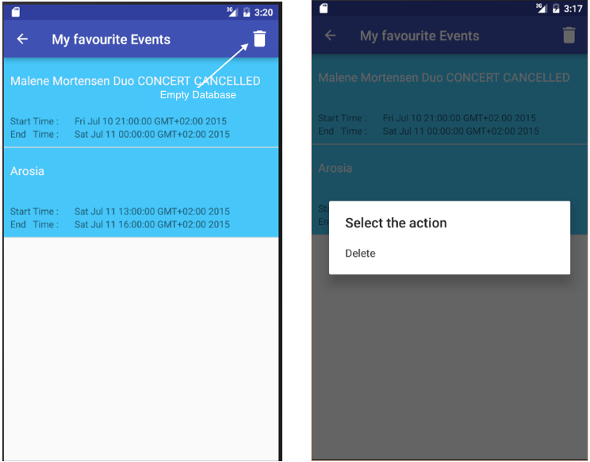
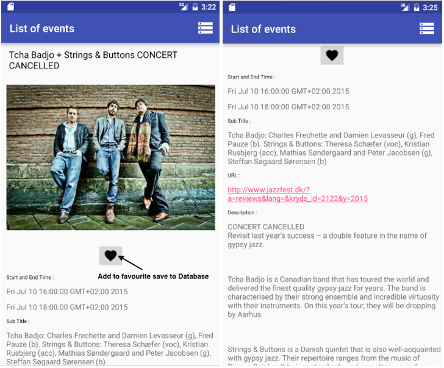

# Events in Aarhus, Android

Android App for showing and storing information in the SQLite database about current events in Aarhus. 

The Events App retrieve JSON data events from a URL. Retrieved information includes current events in Aarhus are shown in a list. The list consists of a title, start time and end time of the event. The List includes Checkbox that shows if the event exists in the Database. When clicking on an event in the list application displaying description with more information about selected Event.

```
* SQLite
* JSON
* List Fragments

```

## The list of events

<p align="center">
  
</p>

## The landscape view

<p align="center">
  
</p>

## The favorite Event

<p align="center">
  
  
</p>